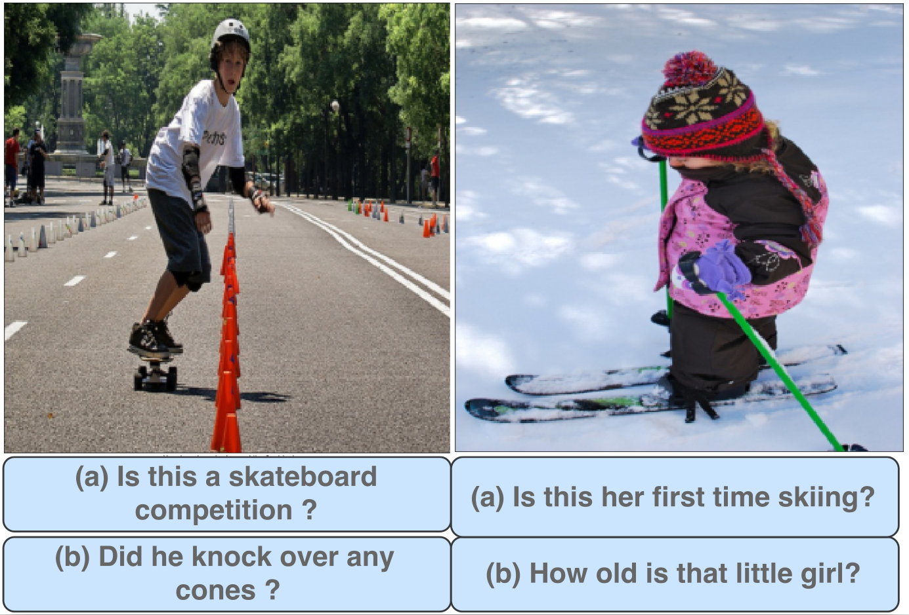
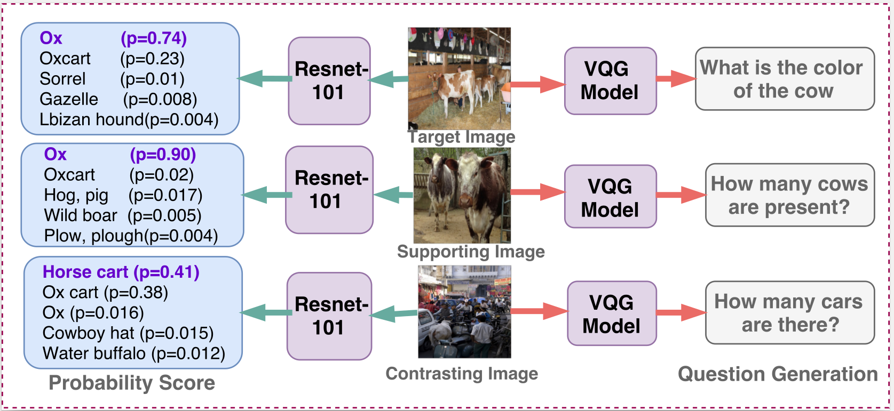
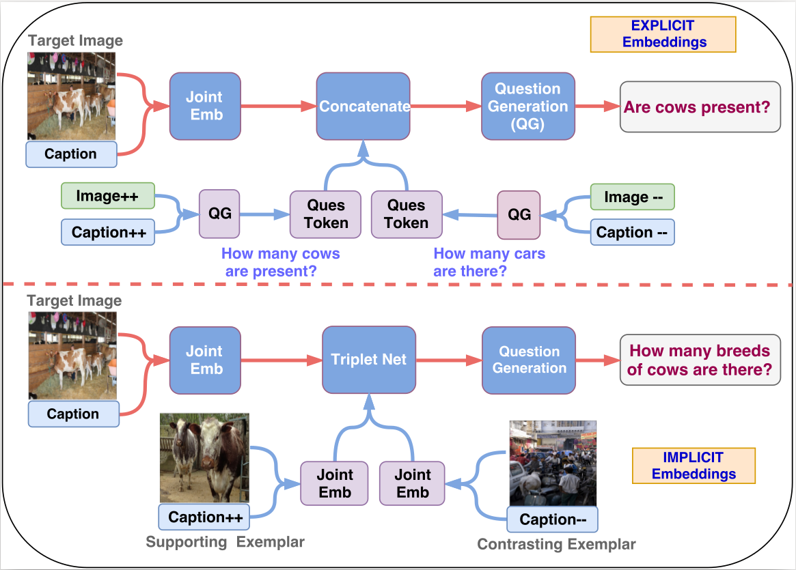
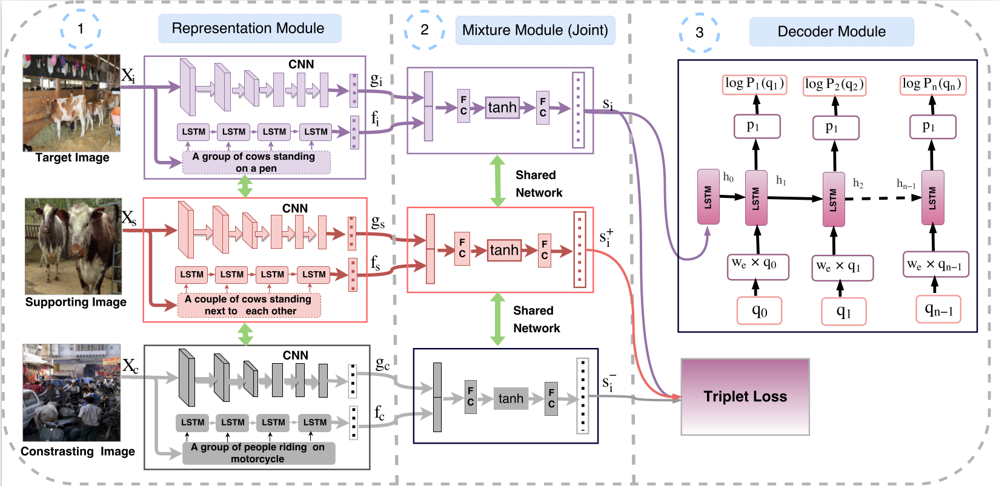
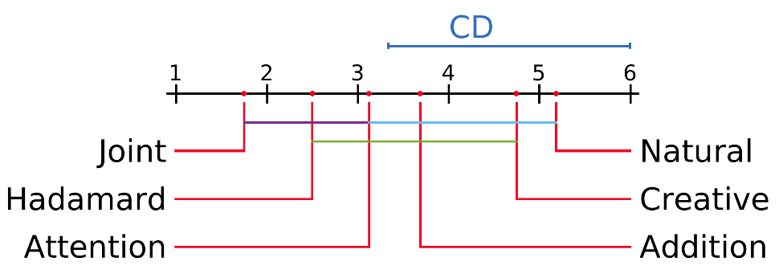
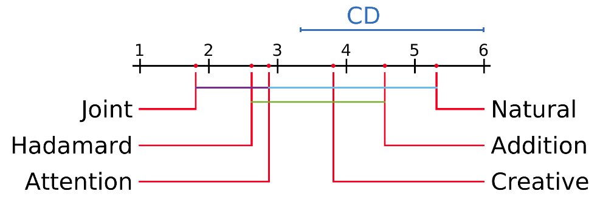
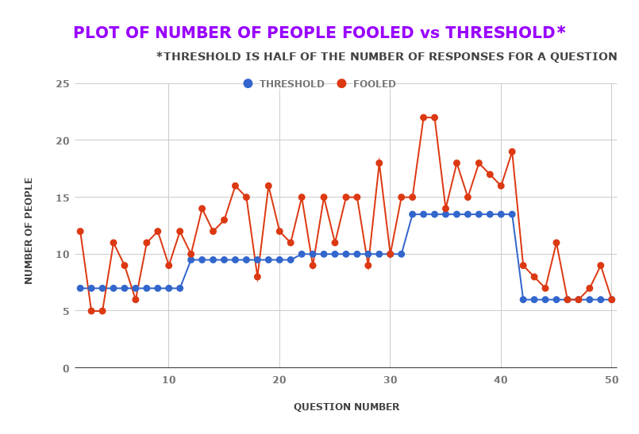
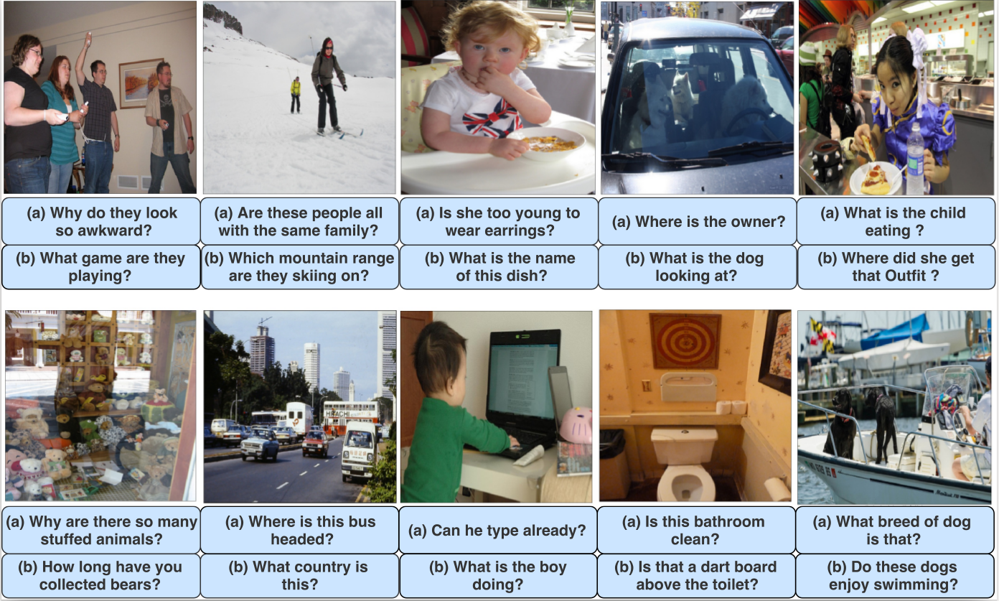

## Multimodal Differential Network for Visual Question Generation [[Paper: EMNLP-2018](http://aclweb.org/anthology/D18-1434 )]

Badri N. Patro, Sandeep Kumar, Vinod K. Kurmi, Vinay P. Namboodiri

## Link for [MDN_VQG Code](https://github.com/badripatro/Visual_Question_Generation)


### Contributions
- Provide a method to incorporate exemplars to learn differential embeddings that captures the subtle differences between supporting and contrasting examples. 
- Propose Multimodal differential embeddings, as image or text alone does not capture the whole context and show that these embeddings outperform the ablations which incorporate single cue such as only image, or tags or place information.
<p align="center">
 
</p>

### Motivation
 
- We experimented with different multimodal embeddings and found out the image-caption joint embedding to perform the best.
- Empirical evidence also suggests the use of implicit embeddings for generating the joint embeddings for exemplars over an explicit bag-of-words representation. 
- We use a triplet network which ensures that the target multimodal embeddings are closer to the supporting ones and vice-versa.

 


### Method
* Encoder Decoder architecture: We use Representation and Mixture modules to obtain a joint Image-Caption embedding and then a Decoder module to generate a natural language question.
* Representation Module: consists of a VGG-19 CNN to obtain image representation and LSTM for caption embedding for Target, Supporting and Contrasting exemplars.
* Mixture Module: takes in the image and caption embeddings and outputs 3 joint embeddings which are fed into a triplet network.
* Decoder Module: takes the target image-caption embedding and produces a sequence of question words. Our method is trained end to end.
 

### Statistical Significance Analysis


The mean rank of all the models on the basis of METEOR and Blue score are plotted on the x-axis. Here Joint refers to our MDN-Joint model. The colored lines between the two models represents that these models are not significantly different from each other.
 
 


### Human Survey
For human evalutions, we have created 10 different google forms each have 10 random set of image-question pairs. 
The link for the human evalation form is given as: 
[Human Survey](https://vinodkkurmi.github.io/vqg)

#### Perceptual Realism
Perceptual Realism Plot for human survey. Here every question has different number of responses and hence the threshold which is the half of total responses for each question is varying. This plot is only for 50 of the 100 questions involved in the survey.



### Result
 


### Reference

```
@InProceedings{D18-1434,
  author = 	"Patro, Badri Narayana
		and Kumar, Sandeep
		and Kurmi, Vinod Kumar
		and Namboodiri, Vinay",
  title = 	"Multimodal Differential Network for Visual Question Generation",
  booktitle = 	"Proceedings of the 2018 Conference on Empirical Methods in Natural Language Processing",
  year = 	"2018",
  publisher = 	"Association for Computational Linguistics",
  pages = 	"4002--4012",
  location = 	"Brussels, Belgium",
  url = 	"http://aclweb.org/anthology/D18-1434"
}
```
